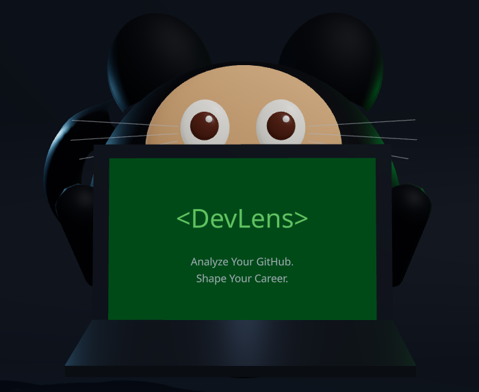
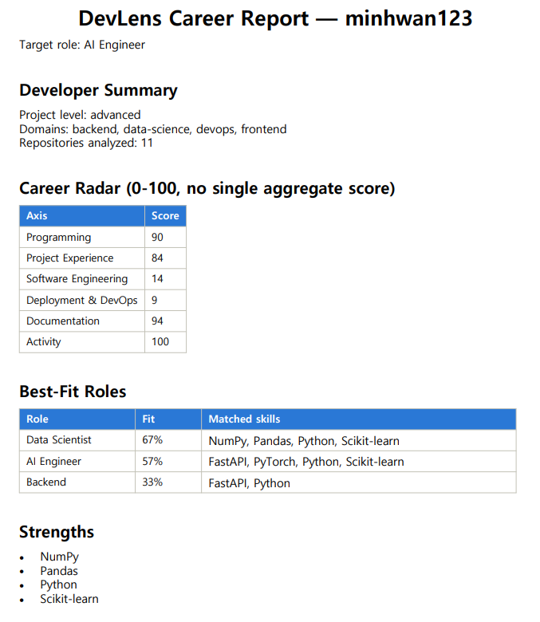

# DevLens

<p align="center">
  
</p>

<h3 align="center">Analyze your GitHub. Understand your career.</h3>

<p align="center">
GitHub 사용자명과 목표 직무만 입력하면, 실제 커밋·코드·문서를 근거로 커리어 역량을 분석해<br/>
레이더 차트, 직무 적합도, 스킬 갭, 학습 로드맵, AI 코멘터리까지 뽑아주는 웹 서비스입니다.
</p>

<p align="center">
<a href="https://github.com/minhwan123/DevLens/actions/workflows/ci.yml"></a>
<a href="LICENSE"></a>
<a href="pyproject.toml"></a>
</p>

## 데모

`minhwan123` 계정을 목표 직무 `AI Engineer`로 실제 분석한 화면입니다 (모의 데이터 아님).


원본 화질/음성이 있는 영상은 [demo_video.mp4](assets/demo_video.mp4)에서 바로 재생해볼 수 있습니다.

### PDF 리포트 예시

분석이 끝나면 아래처럼 PDF로도 내보낼 수 있습니다.

<p align="center">
  
</p>

## 주요 기능

- **GitHub 저장소 자동 분석** — 공개 레포의 커밋, 언어, 문서(README)까지 실제 데이터를 근거로 스킬을 추출
- **커리어 레이더 차트** — Programming / Project Experience / Software Engineering / Deployment & DevOps / Documentation / Activity 6개 축 점수화
- **레이더 변화 추이** — 재분석할 때마다 SQLite에 스냅샷을 남겨 시간에 따른 성장 추이를 시각화
- **목표 직무 적합도 TOP 3** — 9개 직무(AI Engineer, Data Scientist, Backend 등) 중 가장 잘 맞는 직무와 갭을 함께 제시
- **근거 기반 스킬 테이블** — 각 스킬의 숙련도와 "어느 레포에서 왜 그렇게 판단했는지" 근거를 함께 표시
- **강점 / 성장 포인트** — 데이터로 뒷받침되는 강점과 보완이 필요한 영역을 함께 제시
- **저장소 필터링 근거 공개** — 분석에 어떤 레포가 포함/제외됐는지와 그 기준 점수를 그대로 보여줌
- **개선 제안 & 학습 로드맵** — 목표 직무까지 가기 위해 무엇을, 어떤 순서로 학습할지 체인 형태로 제시
- **의미 기반 추천** — Sentence-Transformers 임베딩 + FAISS 유사도 검색으로 프로젝트/스킬/데이터셋을 추천
- **AI 코멘터리** — Gemini가 강점·성장 포인트·학습 로드맵을 자연어로 요약 (키가 없으면 자동으로 플레이스홀더로 폴백)
- **PDF 리포트 다운로드** — 분석 결과를 ReportLab으로 렌더링한 리포트로 내보내기
- **비동기 분석 파이프라인** — 분석 요청은 즉시 202로 잡을 생성하고, 프론트는 상태를 폴링해 진행 상황을 보여줌

## 기술 스택

| 영역 | 스택 |
|---|---|
| Backend | Python 3.12, FastAPI, Pydantic v2, httpx, Uvicorn |
| ML / 검색 | Sentence-Transformers, FAISS |
| LLM | Google Gemini (`google-genai`) |
| 리포트 | ReportLab (PDF) |
| 저장소 | SQLite (레이더 히스토리) |
| Frontend | React 19, TypeScript, Vite |
| 시각화 | Recharts, react-three-fiber / drei / three.js |
| 애니메이션 | Framer Motion |
| 테스트 / 품질 | pytest, pytest-cov, ruff, mypy(strict), respx, oxlint |

## 아키텍처

백엔드는 도메인 로직과 외부 의존성을 분리한 계층형(클린) 아키텍처를 따릅니다.

```
devlens/
├── domain/            # 순수 비즈니스 로직 — 외부 라이브러리에 의존하지 않음
│   ├── engines/       #   분석 엔진 (GitHub 분석, 커리어 인텔리전스, 개선 제안, 로드맵, 역할 적합도 ...)
│   ├── models/        #   도메인 모델 (DeveloperProfile, RadarSnapshot, SkillEvidence ...)
│   └── policies/      #   점수 산정 규칙 (숙련도, 우선순위, 저장소 필터링, 스킬 갭 정책 ...)
├── application/       # 유스케이스 오케스트레이션 (analyze_repository, generate_career_report, recommend_learning_path ...)
├── infrastructure/    # 외부 연동 구현체
│   ├── github/        #   GitHub REST API 클라이언트 + 레이트리밋 처리
│   ├── llm/           #   Gemini 클라이언트 + 응답 캐싱
│   ├── persistence/    #   Job / Cache / Snapshot 저장소 (SQLite, in-memory)
│   ├── reporting/      #   PDF 리포트 빌더
│   └── vector_store/   #   임베딩 모델 + FAISS 유사도 인덱스
├── config/            # 환경설정(Settings) + 도메인 임계값·가중치·직무 요구사항 등 상수
├── interface/api/     # FastAPI 진입점 (라우터, 스키마, 의존성 주입)
└── tests/             # unit / integration / e2e

frontend/
└── src/
    ├── components/     # 랜딩 3D 씬, 레이더 차트, 스킬 테이블, 추천 탭 ...
    ├── hooks/          # 잡 상태 폴링 등
    └── api/            # 백엔드 클라이언트
```

의존 방향은 `interface → application → domain`이며, `infrastructure`는 `domain`의 모델을 사용해 외부 세계(GitHub API, Gemini, SQLite, FAISS)와 통신하는 어댑터 역할을 합니다. 덕분에 도메인 엔진과 정책은 순수 함수/클래스로 테스트가 쉽고, GitHub API나 LLM을 교체해도 도메인 로직은 그대로 유지됩니다.

## 시작하기

### 사전 준비

- Python 3.12+
- Node.js 22+
- (선택) [GitHub 토큰](https://github.com/settings/tokens) — 없으면 비인증 요청 한도(시간당 60회)로 동작
- (선택) [Gemini API 키](https://aistudio.google.com/apikey) — 없으면 AI 코멘터리가 플레이스홀더로 대체

### 1) 환경 변수

```bash
cp .env.example .env
# .env를 열어 GITHUB_TOKEN, GEMINI_API_KEY를 채워주세요 (둘 다 선택 사항)
```

### 2) 로컬에서 직접 실행

```bash
# 백엔드
python -m venv myvenv
myvenv\Scripts\activate        # macOS/Linux: source myvenv/bin/activate
pip install -r requirements-dev.txt
uvicorn devlens.interface.api.app:app --reload

# 프론트엔드 (다른 터미널)
cd frontend
npm install
npm run dev
```

브라우저에서 `http://localhost:5173` 접속.

### 3) Docker로 한 번에 실행

```bash
cp .env.example .env   # 위와 동일하게 채워주세요
docker compose up --build
```

- 프론트엔드: http://localhost:5173
- 백엔드: http://localhost:8000 (`/docs`에서 Swagger UI 확인 가능)

## API

| Method | Path | 설명 |
|---|---|---|
| `POST` | `/analyze` | 분석 잡 생성 (202 Accepted, `job_id` 반환) |
| `GET` | `/analyze/{job_id}/status` | 잡 상태 조회 (`pending` → `running` → `completed`/`failed`) |
| `GET` | `/analyze/{job_id}/report.pdf` | 완료된 분석의 PDF 리포트 다운로드 |
| `GET` | `/health` | 헬스체크 |

전체 스펙은 서버 실행 후 `/docs`(Swagger)에서 확인할 수 있습니다.

## 테스트 & 품질

```bash
pytest --cov                 # 단위 / 통합 / e2e 테스트 + 커버리지
ruff check .                 # 린트
mypy                          # 정적 타입 체크 (strict)

cd frontend
npm run lint                  # oxlint
npm run build                 # 타입 체크 + 프로덕션 빌드
```

GitHub Actions에서 push/PR마다 위 검사를 모두 자동 실행합니다 (`.github/workflows/ci.yml`).

## 라이선스

[MIT](LICENSE)
